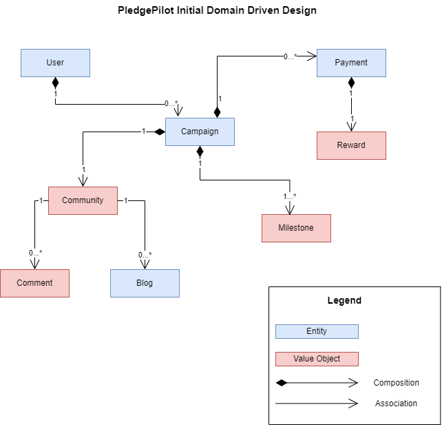

# PledgePilot 
Make your dream project a reality from community support  

_"PledgePilot is a crowdfunding application which incentivizes people for funding hobby projects and initiatives to help them grow"_
## Authors  

**Kartikey Vijayakumar Hebbar**	(vijayakumarhebbar.k@northeastern.edu)  
**Kartik Shanbhag**	(shanbhag.k@northeastern.edu)  
**Aaryan Praveen** (praveen.aa@northeastern.edu)  
**Deepansh Chaturvedi**	(chaturvedi.de@northeastern.edu)  

### Development Updates (as of 11/21/2023)  
- Discover API (GET) : **(author @KartikShanbhag)** This API is responsible to fetch all campaign objects from the database  
- Campaign API (GET/POST) : **(author @KartikeyHebbar)** This API is responsible for adding a new campaign to the database and fetching a campaigns by their name from the database  
- Community API (GET/POST/PATCH) : **(author @DeepanshChaturvedi)** This API is responsible for adding a new community to the database, fetching a new community and updating the community and its fields in the database  
- User API (GET/PUT/POST/DELETE) : **(author @AaryanPraveen)** This API is responsible for adding user profiles, updating and deleting them on the database. This API also fetches all or one user from the database  

## High-Level Features

- User Authentication and Registration
- Create Campaign/View other Campaigns
- Donate to Campaigns using integrated payment gateway
- Campaign Owners can set and track the funding milestones for their projects
- **Gamification:** Donors get an assured reward for every donations they make in the form of virtual tokens

## Technologies Used

- Node.js/Express.js
- Next.js/React.js
- Google OAuth API
- Stripe API
- HTML/CSS/Sass
- MongoDB/Mongoose
- Redux

## Installation and Setup

1. Clone the repository.
2. Install dependencies using `npm install.`
3. Set up environment variables for APIs (Google OAuth, Stripe) and database connection.
4. Run the server using `npm run start.`

## Usage

### Authentication

- **OAuth Login:** Log in using OAuth with your Google account. Click the "Login with Google" button to authenticate.
- **Local Registration:** Alternatively, you can register a new user and then log in. We use JWT for authentication and authorization.

### Dashboard and Homepage

- Once logged in, you'll be redirected to the homepage.
- Navigate to your dashboard from the homepage, where you can:
  - View campaigns you follow and those you've created.
  - Create new campaigns and follow existing ones.
  - Edit campaigns you've created.
  - Join communities associated with campaigns and post blogs using the CKeditor library.

### Campaigns

- Explore existing campaigns on the "Discover" page.
- Contribute to campaigns by making donations.

### Stats and Milestones

- Each campaign has its own stats, showcasing milestones and the total amount raised.

### Profile Page

- Visit your profile page to:
  - View a history of your donations.
  - See the rewards you've earned from donations.
  - Access the "Redeem Offers" section to redeem rewards.

### Rewards and Gamification

- PledgePilot introduces a unique gamification aspect with rewards.
- Earned rewards can be redeemed for offers available in the "Redeem Offers" section.

### Logout

- To log out, click on the "Logout" button in the navbar. You'll be redirected to the login page.

### Note

- Both campaign and blog creation are facilitated by the CKeditor library, providing a rich text editing experience.

## License
This project is licensed under the MIT License.

## Domain Driven Design  

